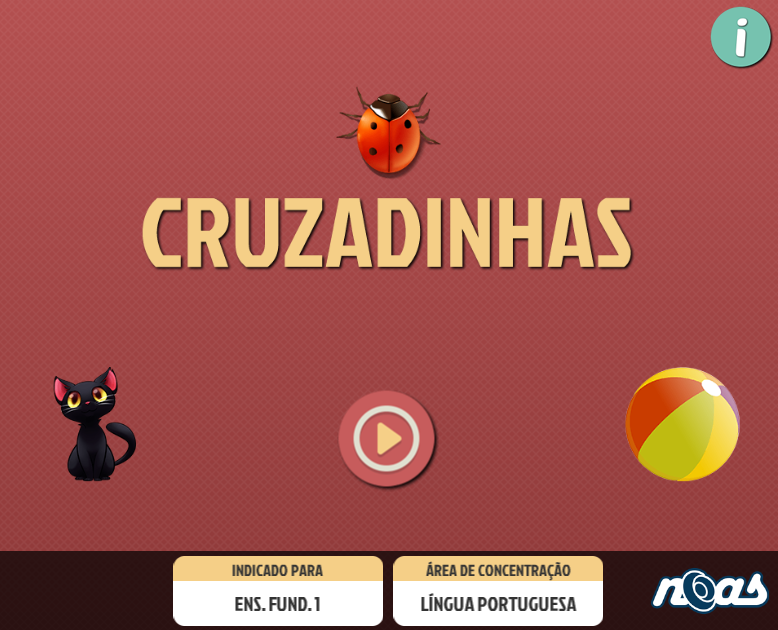
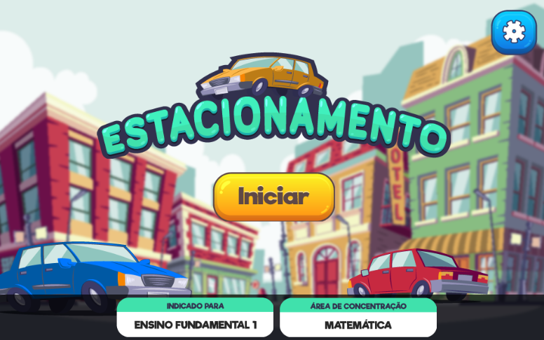
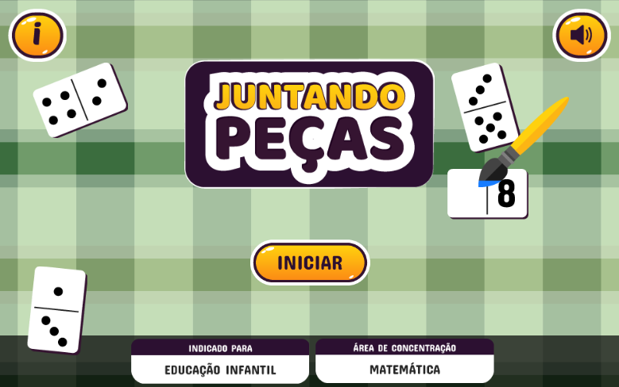

# Games

Estes são alguns dos projetos de games que eu desenvolvi utilizando Animate CC ou Phaser 2.x

## Cruzadinhas

  

Neste jogo, as crianças deve associar as figurinhas com a palavra que as representam por meio da cruzadinha.

## Estacionamento

  

Neste jogo, as crianças aprendem sobre direções, cores e coordenadas.

## Juntando Peças

  

Neste jogo, as crianças precisam associar o número informado na tela à quantidade representada nas peças, colorindo a peça correspondente.